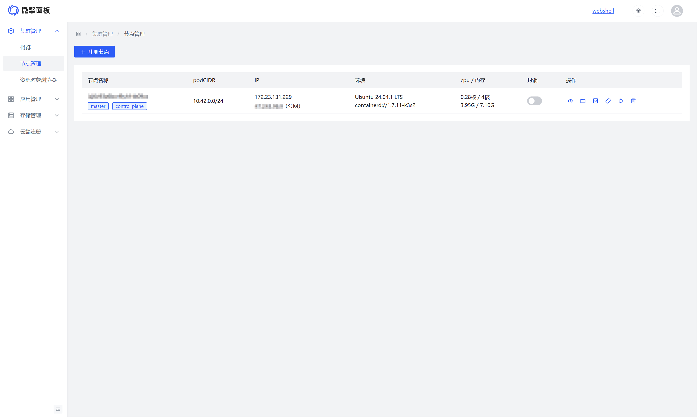
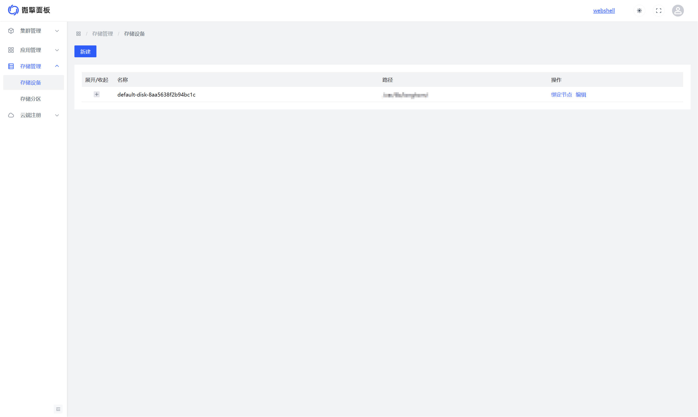

<h1 align="center">
    
    <br>
</h1>

**微擎面板（w7panel）** 一款基于Kubernetes的云原生控制面板。由微擎团队超过十年的运维经验总结而来，同时也为云原生民用化做了大量的努力，经过这几年的研发和打磨，我们推出了一款开箱即用、可民用落地的云原生服务器面板管理系统。
<br><br>

## 环境要求
- 节点服务器配置 >= 2核4G
- 支持主流 Linux 发行版本；（推荐CentOS Stream >= 9 或者 Ubuntu Server >=22）
- 须保证服务器外网端口6443、80、443、9090可访问
- 使用全新的服务器环境来安装，请勿跟其他服务器面板系统混用，以免导致环境冲突
- 浏览器要求：请使用 Chrome、FireFox、IE10+、Edge等现代浏览器；

## 安装部署
```bash
curl -sfL https://cdn.w7.cc/w7panel/install.sh | sh -
```
安装完成后，首次进入后台`http://{ip}:9090`，可设置管理员账号密码。

## 操作手册
- [应用管理](./docs/apps/index.md)
  - [创建应用](./docs/apps/createapp.md)
  - [应用商店](./docs/apps/createapp-appstore.md)
  - [域名管理](./docs/apps/domains.md)
  - [文件管理](./docs/apps/files.md)

## 常见问题
- 如果出网使用了NAT网关，会导致获取公网IP不正确，安装时可赋值环境变量`PUBLIC_IP`来解决，示例：
  
  ```bash
  PUBLIC_IP=123.123.123.123 sh install.sh
  ```

- 如果忘记密码，管理员可在master服务器执行命令来重置密码，`--username`传新管理员名，`--password`传新密码，示例：
  
  ```bash
  kubectl exec -it $(kubectl get pods -n default -l app=w7panel-offline | awk 'NR>1{print $1}') -- ko-app/k8s-offline auth:register --username=admin --password=123456
  ```

- 阿里云服务器可能会因为安装阿里云盾导致微擎面板启动失败，解决方案如下：
  
  1）一般云服务器，可在重做系统时勾选关闭安全加固，也可通过通过命令卸载阿里云盾。
  
  2）轻量应用服务器，可在阿里云控制台->云安全中心->功能设置->客户端，找到您的服务器后，执行卸载操作。
  
  其他问题详见阿里云官方文档：https://help.aliyun.com/zh/security-center/user-guide/uninstall-the-security-center-agent

- 腾讯云服务器可能会因为安装腾讯云主机安全防护（云镜）导致占用内存，对小配置服务器有影响，可执行如下命令对该服务进行卸载：

  ```bash
  /usr/local/qcloud/YunJing/uninst.sh
  /usr/local/qcloud/stargate/admin/uninstall.sh
  /usr/local/qcloud/monitor/barad/admin/uninstall.sh
  ```
  
- 公网IP和内网IP暂时不支持IPv6，否则可能会造成网络组件安装错误，安装前请关闭IPv6，使用IPv4。也可赋值环境变量`PUBLIC_IP`（公网IP）、`INTERNAL_IP`（内网IP）来解决，示例：
  
  ```bash
  PUBLIC_IP=123.123.123.123 INTERNAL_IP=123.123.123.123 sh install.sh
  ```
  
- 多节点集群场景下，当Server节点IP发生变更时，导致Agent节点与Server节点无法正常通信，导致部分服务启动异常时，如何排查和解决：
  
  1）首先输入命令`kubectl get node -o wide`，观察各个节点的ip和状态是否正确，如果节点处于NotReady说明节点状态异常。
  
  2）进入Agent节点服务器，找到`/etc/systemd/system/k3s-agent.service.env`文件，将`K3S_URL`中错误的Server节点IP改为正确的值，然后保存。
  
  3）执行命令`systemctl restart k3s-agent`，重启Agent节点上的k3s服务，等待几分钟后，异常服务即可恢复。

- SELinux 阻止了 /usr/lib/systemd/systemd 对 k3s 文件的执行访问，可能会导致k3s服务启动失败：
  
  启动失败会有如下提示：
  
  ```bash
  Job for k3s-agent.service failed because the control process exited with error code.
  See "systemctl status k3s-agent.service" and "journalctl -xeu k3s-agent.service" for details.
  ```
  
  如何排查确认：
  
  1）执行命令`cat /var/log/messages | grep k3s`，如果有下面这种日志，可以初步确认受SELinux策略影响：
  
  ```bash
  Mar 21 06:04:21 localhost systemd[1]: Starting Lightweight Kubernetes...
  Mar 21 06:04:21 localhost sh[35860]: + /usr/bin/systemctl is-enabled --quiet nm-cloud-setup.service
  Mar 21 06:04:21 localhost systemd[35864]: k3s-agent.service: Failed to locate executable /usr/local/bin/k3s: Permission denied
  Mar 21 06:04:21 localhost systemd[35864]: k3s-agent.service: Failed at step EXEC spawning /usr/local/bin/k3s: Permission denied
  Mar 21 06:04:21 localhost systemd[1]: k3s-agent.service: Main process exited, code=exited, status=203/EXEC
  Mar 21 06:04:21 localhost systemd[1]: k3s-agent.service: Failed with result 'exit-code'.
  Mar 21 06:04:21 localhost systemd[1]: Failed to start Lightweight Kubernetes.
  Mar 21 06:04:21 localhost setroubleshoot[10723]: SELinux is preventing /usr/lib/systemd/systemd from execute access on the file k3s. For complete SELinux messages run: sealert -l 712cf0b8-1f9f-410b-bc85-51389a867449
  Mar 21 06:04:21 localhost setroubleshoot[10723]: SELinux is preventing /usr/lib/systemd/systemd from execute access on the file k3s
  ```

  2）执行命令`setenforce 0`后重启k3s服务，如果是server节点执行`systemctl restart k3s.service`重启，如果是agent节点执行`systemctl restart k3s-agent.service`重启。

  3）如果重启成功，那么就确认受SELinux策略影响。可以通过永久关闭SELinux来解除受限：要永久禁用 SELinux，需要编辑 SELinux 的配置文件。打开`/etc/selinux/config`文件，将`SELINUX=enforcing`改为`SELINUX=disabled`。修改完成后保存文件并重启系统，这样 SELinux 就会在系统启动时被禁用。

- 如果安装了很多应用挤占服务器资源，导致服务器负载飙升，此时可能会造成面板无法访问的情况，如何解决这个问题：

  1）执行`top`命令，然后输入`shift m`和`e`指令来做内存使用率筛选，示例结果：
  ```bash
    top - 18:57:09 up 4 days,  5:11,  6 users,  load average: 1.97, 19.75, 22.71
    Tasks: 256 total,   1 running, 253 sleeping,   0 stopped,   2 zombie
    %Cpu(s):  4.1 us,  3.4 sy,  0.0 ni, 92.4 id,  0.0 wa,  0.0 hi,  0.2 si,  0.0 st 
    MiB Mem :   3595.2 total,    146.3 free,   2699.1 used,   1013.5 buff/cache     
    MiB Swap:   4096.0 total,   3861.3 free,    234.7 used.    896.1 avail Mem 
    
    PID USER      PR  NI    VIRT    RES    SHR S  %CPU  %MEM     TIME+ COMMAND                                                                                                                                        
    505819 root      20   0 2341.2m 841.4m  73.2m S   6.0  23.4     15,21 k3s-server                                                                                                                                     
    512778 root      20   0 1470.3m 222.2m  24.6m S   1.0   6.2  33:06.60 longhorn-manage                                                                                                                                
    520845 root      20   0 1527.5m 189.2m   8.6m S   0.0   5.3  50:42.79 victoria-metric                                                                                                                                
    509034 root      20   0 1376.4m 132.0m  23.3m S   1.3   3.7  85:06.29 cilium-agent
  ```
  2）将内存较高的PID找出来（k3s-server的进程除外），然后执行`kill -9 {PID}`，将高占用的进程临时kill掉，降低负载。
  
  3）然后执行下面的命令先将除面板之外其他应用资源暂时实例数量设置为0，等服务器负载下降后，再进入面板处理：
  
  ```bash
    kubectl get deploy,statefulset,daemonset -n default -o name | grep -v 'w7panel-offline' | xargs -I {} sh -c '
        kubectl scale --replicas=0 {} -n default;
        kubectl get pods -n default -o json | jq -r ".items[] | select(.metadata.ownerReferences[]?.name == \"$(echo {} | cut -d'/' -f 2)\") | .metadata.name" | xargs -r kubectl delete pods -n default
    '
  ```

- 误删微擎面板应用后，导致 `http://{ip}:9090` 无法访问，如何解决这个问题：

  1）先通过 `https://cdn.w7.cc/w7panel/manifests/w7panel-offline.yaml` 查看最新版的面板chart包地址。

  2）然后登录服务器，执行helm命令重安装微擎面板，示例中以1.0.55版本为例：

  ```
  helm upgrade --install \
  w7panel-offline \
  https://cdn.w7.cc/w7panel/charts/w7panel-offline-1.0.55.tgz \
  --version 1.0.55 \
  --namespace default \
  --atomic \
  --set servicelb.loadBalancerClass=io.cilium/node \
  --set servicelb.port=9090
  ```

## 核心优势
- **生产等级**
  
  由微擎团队超过十年的运维经验总结而来，已经经过微擎团队内部业务的大量部署实验，也已经过微擎用户大量的使用反馈和不断打磨，真正可用于生产级别的服务器运维管理面板。

- **简单易用**
  
  我们屏蔽了一些云原生的底层概念，以常规操作面板的思维模式重新构建了一套操作后台，用户既能享受到云原生的快速部署、高可用的性能，也能轻松上手这套系统。

- **应用生态**
  
  我们完善了k8s安装应用的逻辑，增加了依赖应用和安装配置相关的概念，以此总结出了一套应用包机制，让开发者打包应用更便利，让用户安装应用时操作门槛更低。同时系统也内置应用商店，和微擎应用市场的支持，可一键部署各类应用。

## 功能介绍
- **支持多节点**
  
  基于k8s的特性，微擎面板可同时部署到多台节点服务器上，让多个节点组合成集群服务，当流量突发时，一键扩容节点服务器、一键负载均衡，为您的业务提供高可用性能。
  
  
  
  

- **支持多种应用类型**
  
  应用支持通过docker镜像、dockerCompose、k8sYaml、k8sHelm、应用商店等多种安装方式，也支持传统应用、计划任务、反向代理等多种应用类型。
  
  

- **支持分布式存储**
  
  默认支持分布式存储功能，我们对存储管理做了大量改造，使其更符合传统用户对存储的操作逻辑。

  
  
  

- **免费HTTPS证书**
  
  默认支持免费https证书，到期前自动续签，无需人工干预。

  
  

## 社区
**微信群**


